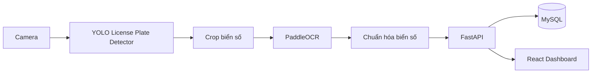

# Smart Parking Management System

Hệ thống quản lý bãi đỗ xe thông minh sử dụng Computer Vision, OCR, FastAPI và React.

## Mục tiêu

Dự án này mô phỏng một hệ thống thực tế tại doanh nghiệp với các năng lực chính:

- Camera nhận diện xe vào và xe ra
- Phát hiện biển số xe bằng YOLOv8/YOLO11
- Đọc biển số bằng PaddleOCR
- Chuẩn hóa biển số bằng regex
- Lưu dữ liệu vào MySQL qua SQLAlchemy
- Quản lý xe đang gửi, lịch sử gửi xe, phí gửi xe, dashboard thống kê
- REST API cho backend và web quản trị cho người dùng nội bộ

## Công nghệ

- Computer Vision: OpenCV
- Deep Learning: PyTorch, YOLOv8 hoặc YOLO11
- OCR: PaddleOCR
- Backend: FastAPI
- ORM: SQLAlchemy
- Database: MySQL
- Frontend: React, TypeScript
- Authentication: JWT
- Deployment: Docker, Docker Compose, Nginx
- DevOps: Git, GitHub, Ubuntu Linux

## Kiến trúc tổng quan



## Quy ước triển khai

Dự án sẽ được xây dựng theo từng phase, không nhảy thẳng vào code lớn. Mỗi phase đều có:

- Mục tiêu
- Kiến thức cần học
- Kiến trúc liên quan
- Danh sách file cần tạo
- Giải thích code
- Best practice
- Debug checklist
- Checklist hoàn thành

Chi tiết kế hoạch nằm trong [docs/ROADMAP.md](docs/ROADMAP.md).

## Cấu trúc thư mục dự kiến

```text
Smart-Parking-Management-System/
├── ai/
├── backend/
├── database/
├── dataset/
├── docker/
├── docs/
├── frontend/
├── scripts/
├── tests/
├── training/
├── weights/
└── README.md
```

## Tài liệu

- [Roadmap tổng thể](docs/ROADMAP.md)
- [SRS](docs/SRS.md)
- [Phase 1: Phân tích yêu cầu](docs/phase-1.md)
- [Phase 2: Thiết kế kiến trúc](docs/phase-2.md)
- [Phase 3: Thiết kế database](docs/phase-3.md)
- [Phase 4: Khởi tạo backend](docs/phase-4.md)
- [Phase 5: Tự huấn luyện YOLO](docs/phase-5.md)
- [Kiến trúc hệ thống](docs/architecture/overview.md)
- [Thiết kế database](docs/architecture/database.md)
- [Cấu trúc thư mục](docs/architecture/folder-structure.md)
- [ER Diagram](docs/diagrams/er-diagram.md)
- [Use Case Diagram](docs/diagrams/use-case.md)
- [Activity Diagram](docs/diagrams/activity.md)
- [Sequence Diagram](docs/diagrams/sequence.md)
- [Class Diagram](docs/diagrams/class.md)
- [Deployment Diagram](docs/diagrams/deployment.md)
- [API Documentation](docs/api/README.md)
- [Git Flow](docs/git-flow.md)

## Trạng thái hiện tại

Phase 1 sẽ tập trung vào phân tích yêu cầu và chốt kiến trúc nền trước khi viết backend, AI pipeline và frontend.
