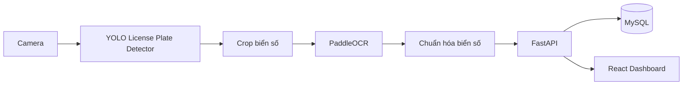

# Smart Parking Management System

Hệ thống quản lý bãi đỗ xe thông minh sử dụng Computer Vision, OCR, FastAPI, React và Docker.

## Overview

Smart Parking Management System mô phỏng một workflow doanh nghiệp hoàn chỉnh:

- Camera nhận diện xe vào và xe ra
- YOLO tự huấn luyện để detect biển số
- PaddleOCR đọc biển số
- Chuẩn hóa biển số bằng regex
- FastAPI xử lý nghiệp vụ, session, fee và history
- React dashboard hiển thị trạng thái bãi xe
- Docker Compose và Nginx dùng cho deploy local/production-like

## Architecture



## Tech Stack

- AI/CV: OpenCV, PyTorch, YOLOv8/YOLO11, PaddleOCR
- Backend: FastAPI, SQLAlchemy, JWT
- Frontend: React, TypeScript, Vite
- Database: MySQL
- Deploy: Docker, Docker Compose, Nginx, Ubuntu Linux

## Quick Start

### 1. Docker Compose

```bash
cp docker/.env.example docker/.env
cd docker
docker compose up --build
```

- Frontend: http://localhost
- Backend: http://localhost:8000
- API docs: http://localhost:8000/docs

### 2. Frontend only

```bash
cd frontend
npm install
npm run dev
```

### 3. Backend only

```bash
cd backend
pip install -r requirements.txt
uvicorn app.main:app --reload --host 0.0.0.0 --port 8000
```

## Highlights

- AI pipeline tách riêng khỏi business logic
- Backend theo Clean Architecture
- Có kiểm thử service, frontend build smoke test và compose config validation
- Có tài liệu đầy đủ cho roadmap, architecture, database, deploy và portfolio

## Project Status

- Phase 1-12 đã được thiết kế và scaffold đầy đủ
- Backend, frontend, training, docker và deploy assets đã có
- Suite kiểm thử hiện tại đã pass ở mức scaffold
- Sẵn sàng dùng làm portfolio, GitHub repo và talking points khi phỏng vấn

## Documentation

- [Roadmap](docs/ROADMAP.md)
- [SRS](docs/SRS.md)
- [Phase 1](docs/phase-1.md)
- [Phase 2](docs/phase-2.md)
- [Phase 3](docs/phase-3.md)
- [Phase 4](docs/phase-4.md)
- [Phase 5](docs/phase-5.md)
- [Phase 6](docs/phase-6.md)
- [Phase 7](docs/phase-7.md)
- [Phase 8](docs/phase-8.md)
- [Phase 9](docs/phase-9.md)
- [Phase 10](docs/phase-10.md)
- [Phase 11](docs/phase-11.md)
- [Phase 12](docs/phase-12.md)
- [Architecture Overview](docs/architecture/overview.md)
- [Database Design](docs/architecture/database.md)
- [Docker README](docker/README.md)
- [Deploy README](deploy/README.md)
- [Portfolio Guide](docs/portfolio-guide.md)
- [Demo Script](docs/demo-script.md)
- [Interview Notes](docs/interview-notes.md)

## Repository Layout

```text
Smart-Parking-Management-System/
├── ai/
├── backend/
├── database/
├── dataset/
├── deploy/
├── docker/
├── docs/
├── frontend/
├── scripts/
├── tests/
├── training/
└── weights/
```
