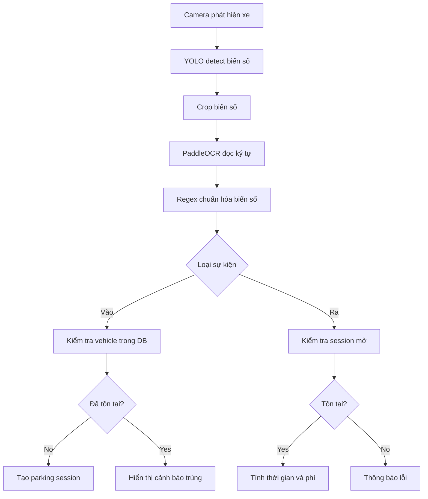

# Activity Diagram

```mermaid
flowchart TD
    A[Camera phát hiện xe] --> B[YOLO detect biển số]
    B --> C[Crop biển số]
    C --> D[PaddleOCR đọc ký tự]
    D --> E[Regex chuẩn hóa biển số]
    E --> F{Loại sự kiện}
    F -->|Vào| G[Kiểm tra vehicle trong DB]
    G --> H{Đã tồn tại?}
    H -->|No| I[Tạo parking session]
    H -->|Yes| J[Hiển thị cảnh báo trùng]
    F -->|Ra| K[Kiểm tra session mở]
    K --> L{Tồn tại?}
    L -->|Yes| M[Tính thời gian và phí]
    L -->|No| N[Thông báo lỗi]
```
