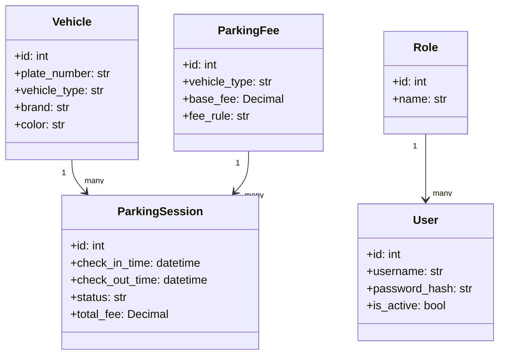

# Class Diagram

```mermaid
classDiagram
    class Vehicle {
        +id: int
        +plate_number: str
        +vehicle_type: str
        +brand: str
        +color: str
    }

    class ParkingSession {
        +id: int
        +check_in_time: datetime
        +check_out_time: datetime
        +status: str
        +total_fee: Decimal
    }

    class ParkingFee {
        +id: int
        +vehicle_type: str
        +base_fee: Decimal
        +fee_rule: str
    }

    class User {
        +id: int
        +username: str
        +password_hash: str
        +is_active: bool
    }

    class Role {
        +id: int
        +name: str
    }

    Vehicle "1" --> "many" ParkingSession
    ParkingFee "1" --> "many" ParkingSession
    Role "1" --> "many" User
```
