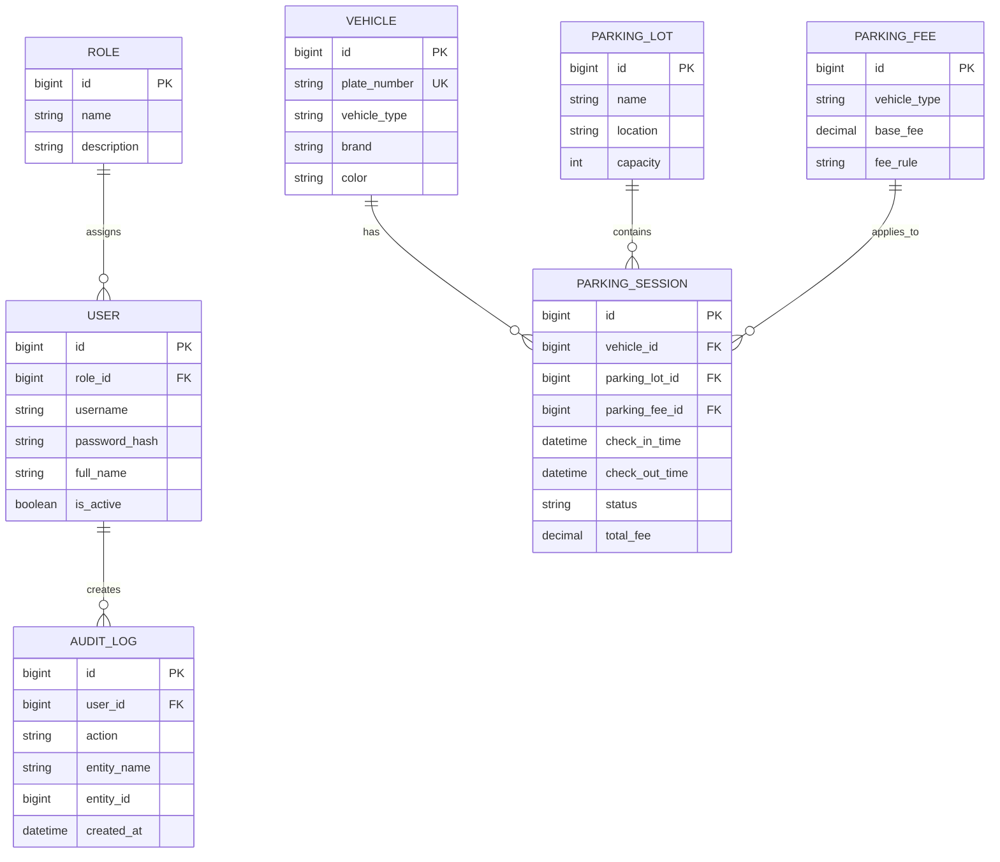

# ER Diagram

```mermaid
erDiagram
    ROLE ||--o{ USER : assigns
    VEHICLE ||--o{ PARKING_SESSION : has
    PARKING_LOT ||--o{ PARKING_SESSION : contains
    USER ||--o{ AUDIT_LOG : creates
    PARKING_FEE ||--o{ PARKING_SESSION : applies_to

    ROLE {
        bigint id PK
        string name
        string description
    }

    USER {
        bigint id PK
        bigint role_id FK
        string username
        string password_hash
        string full_name
        boolean is_active
    }

    VEHICLE {
        bigint id PK
        string plate_number UK
        string vehicle_type
        string brand
        string color
    }

    PARKING_LOT {
        bigint id PK
        string name
        string location
        int capacity
    }

    PARKING_FEE {
        bigint id PK
        string vehicle_type
        decimal base_fee
        string fee_rule
    }

    PARKING_SESSION {
        bigint id PK
        bigint vehicle_id FK
        bigint parking_lot_id FK
        bigint parking_fee_id FK
        datetime check_in_time
        datetime check_out_time
        string status
        decimal total_fee
    }

    AUDIT_LOG {
        bigint id PK
        bigint user_id FK
        string action
        string entity_name
        bigint entity_id
        datetime created_at
    }
```
