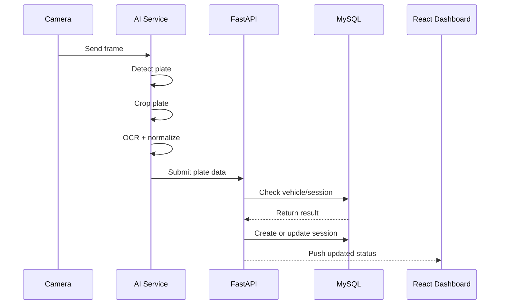

# Sequence Diagram

```mermaid
sequenceDiagram
    participant Cam as Camera
    participant AI as AI Service
    participant API as FastAPI
    participant DB as MySQL
    participant UI as React Dashboard

    Cam->>AI: Send frame
    AI->>AI: Detect plate
    AI->>AI: Crop plate
    AI->>AI: OCR + normalize
    AI->>API: Submit plate data
    API->>DB: Check vehicle/session
    DB-->>API: Return result
    API->>DB: Create or update session
    API-->>UI: Push updated status
```
