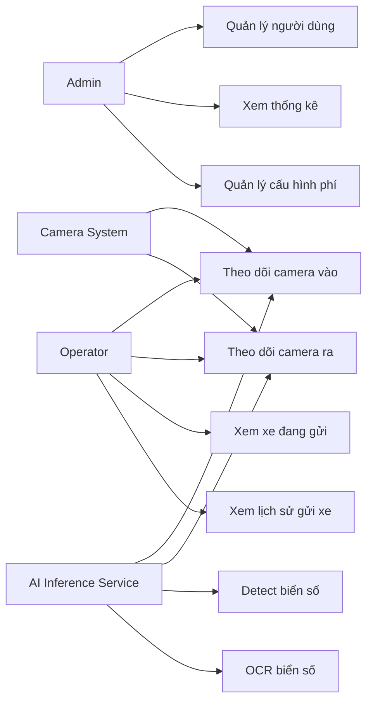

# Use Case Diagram

```mermaid
flowchart LR
    Admin[Admin] --> UC1[Quản lý người dùng]
    Admin --> UC2[Xem thống kê]
    Admin --> UC3[Quản lý cấu hình phí]

    Operator[Operator] --> UC4[Theo dõi camera vào]
    Operator --> UC5[Theo dõi camera ra]
    Operator --> UC6[Xem xe đang gửi]
    Operator --> UC7[Xem lịch sử gửi xe]

    Camera[Camera System] --> UC4
    Camera --> UC5
    AI[AI Inference Service] --> UC4
    AI --> UC5
    AI --> UC8[Detect biển số]
    AI --> UC9[OCR biển số]
```
