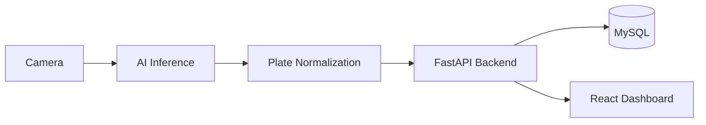

# Phase 2: Thiết Kế Kiến Trúc

Phase 2 chuyển từ “hiểu bài toán” sang “thiết kế hệ thống để code được thật”. Đây là phase quyết định dự án có trông như một sản phẩm doanh nghiệp hay chỉ là một demo ghép nối rời rạc.

## 1. Mục tiêu của phase

- Chốt kiến trúc tổng thể cho backend, AI, frontend, database và deployment
- Xác định boundary rõ ràng giữa các module
- Thiết kế luồng dữ liệu từ camera đến dashboard
- Chốt chiến lược tách layer để dễ mở rộng và dễ test
- Định nghĩa cấu trúc thư mục chuẩn trước khi bắt đầu scaffold code

## 2. Kiến thức cần có

- Clean Architecture
- Layered Architecture
- RESTful API design
- Dependency inversion
- DTO, schema, repository, service pattern
- Cách tách AI inference service khỏi business service
- Kiến trúc triển khai bằng Docker

## 3. Vì sao cần làm phase này kỹ

Nếu bỏ qua phase này, dự án rất dễ rơi vào các lỗi sau:

- Controller chứa business logic
- AI và nghiệp vụ bị trộn vào cùng một lớp
- Cấu trúc thư mục thay đổi liên tục theo từng feature
- Không thể test riêng service hoặc repository
- Khó deploy vì thiếu boundary rõ ràng giữa service

Một kiến trúc tốt giúp:

- Dễ mở rộng sang nhiều camera hoặc nhiều bãi xe
- Dễ thay model YOLO/OCR mà không đập lại backend
- Dễ viết test
- Dễ giải thích trong phỏng vấn
- Dễ đóng gói thành portfolio chuyên nghiệp

## 4. Kiến trúc tổng thể

### 4.1 Thành phần chính

- Camera stream: nguồn ảnh/video đầu vào
- AI inference service: detect biển số, crop ảnh, OCR, chuẩn hóa text
- Backend FastAPI: xử lý nghiệp vụ, auth, session, dashboard, API
- MySQL: lưu dữ liệu nghiệp vụ
- Frontend React: hiển thị dashboard, quản trị, lịch sử, thống kê
- Docker Compose: gom toàn bộ môi trường local/dev

### 4.2 Luồng dữ liệu

1. Camera gửi frame về AI service
2. YOLO detect biển số
3. Crop vùng biển số
4. PaddleOCR đọc ký tự
5. Regex chuẩn hóa biển số
6. Backend nhận plate number và metadata
7. Backend kiểm tra vehicle/session trong database
8. Backend tạo check-in hoặc check-out theo rule nghiệp vụ
9. Frontend lấy dữ liệu từ API và cập nhật dashboard

### 4.3 Sơ đồ luồng logic



## 5. Lựa chọn kiến trúc backend

### 5.1 Chọn Clean Architecture

Lý do chọn Clean Architecture:

- Business logic nằm ở lõi, không phụ thuộc framework
- Dễ thay FastAPI bằng framework khác nếu cần
- Dễ mock repository khi test service
- Phù hợp dự án portfolio vì thể hiện tư duy thiết kế

### 5.2 Các layer chính

- Presentation layer: controller, router, API schema
- Application layer: service, use case, DTO
- Domain layer: entity, rule, interface
- Infrastructure layer: database, repository, external integrations

### 5.3 Nguyên tắc quan trọng

- Controller chỉ nhận request và trả response
- Service chứa business logic
- Repository chỉ thao tác database
- Model database không được rò rỉ trực tiếp ra frontend
- AI inference nên được bọc trong một module riêng

## 6. Lựa chọn kiến trúc AI

### 6.1 Tách riêng AI pipeline

AI pipeline nên tách thành module riêng vì:

- Có thể thay YOLO model mà không ảnh hưởng backend
- Có thể benchmark OCR độc lập
- Có thể chạy inference theo batch hoặc realtime
- Dễ debug từng bước: detect, crop, OCR, normalize

### 6.2 Module AI đề xuất

- detector: YOLO detect biển số
- preprocessor: resize, normalize, enhance image
- ocr: PaddleOCR inference
- postprocess: regex, chuẩn hóa plate, filter confidence
- utils: lưu ảnh, log, benchmark

## 7. Lựa chọn kiến trúc frontend

### 7.1 Mục tiêu UI

Frontend không chỉ là giao diện đẹp mà còn phải hỗ trợ:

- Theo dõi xe đang gửi theo thời gian thực
- Xem lịch sử và doanh thu
- Xem camera live
- Quản lý người dùng, vehicle, fee settings
- Dark mode và responsive layout

### 7.2 Tổ chức frontend

- pages: màn hình chính
- components: component tái sử dụng
- features: module theo domain
- services: gọi API
- hooks: logic dùng chung
- types: TypeScript types
- styles: theme, dark mode, tokens

## 8. Cấu trúc thư mục chuẩn đề xuất

```text
Smart-Parking-Management-System/
├── ai/
│   ├── inference/
│   ├── models/
│   ├── utils/
│   └── README.md
├── backend/
│   ├── app/
│   │   ├── api/
│   │   ├── core/
│   │   ├── domain/
│   │   ├── infrastructure/
│   │   ├── schemas/
│   │   └── main.py
│   └── tests/
├── frontend/
│   ├── src/
│   │   ├── components/
│   │   ├── features/
│   │   ├── pages/
│   │   ├── services/
│   │   ├── hooks/
│   │   └── styles/
│   └── public/
├── training/
├── weights/
├── dataset/
├── database/
├── docker/
├── scripts/
├── tests/
└── docs/
```

## 9. Class and module boundary

### Backend

- controllers: nhận request
- services: xử lý logic
- repositories: truy xuất dữ liệu
- schemas: validate input/output
- models: ánh xạ DB
- middleware: auth, logging, error handling

### AI

- detector service
- OCR service
- plate normalization utility
- image preprocessing utility

### Frontend

- dashboard page
- vehicle management page
- parking history page
- statistics page
- settings page
- user management page

## 10. Best practice

- Thiết kế API version từ đầu
- Dùng environment variables cho config
- Không hardcode đường dẫn model, DB host, secret key
- Giữ naming thống nhất giữa code và database
- Tách DTO khỏi entity/model
- Có lớp service riêng cho fee calculation
- Có lớp audit log riêng cho thao tác quan trọng
- Chuẩn hóa response format ngay từ đầu

## 11. Các lỗi thường gặp

- Nhồi mọi thứ vào một router FastAPI
- Để frontend gọi trực tiếp vào database hoặc logic nội bộ
- Không phân tầng rõ giữa use case và repository
- Không xác định trạng thái session nên khó tính phí
- Thiết kế folder theo cảm hứng, không theo domain
- Không chuẩn bị đường đi cho testing và deployment

## 12. Cách debug kiến trúc

- Kiểm tra boundary giữa controller, service, repository bằng review code
- Viết test cho service trước khi nối UI
- Test AI module với ảnh mẫu độc lập
- Lưu log request id xuyên suốt pipeline
- Dùng docker compose để giả lập toàn hệ thống ngay từ local
- So sánh output của từng layer thay vì debug end-to-end ngay

## 13. Checklist hoàn thành

- [ ] Chốt kiến trúc tổng thể
- [ ] Chốt Clean Architecture cho backend
- [ ] Chốt module AI tách riêng
- [ ] Chốt cấu trúc frontend theo feature/domain
- [ ] Chốt cấu trúc thư mục repo
- [ ] Chốt nguyên tắc config và environment
- [ ] Chốt boundary giữa service nội bộ và API
- [ ] Hoàn thiện sơ đồ deployment

## 14. Kết quả đầu ra của phase

Sau phase này, dự án phải có kiến trúc đủ rõ để bắt đầu scaffold backend, thiết kế database chi tiết và chuẩn bị training pipeline mà không phải đập đi làm lại.
